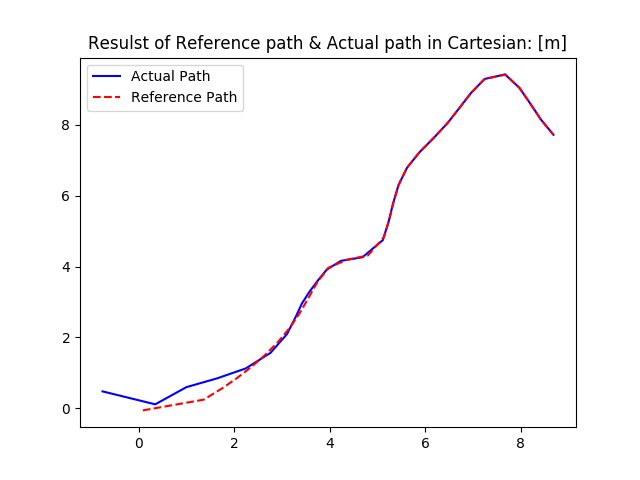

# Planning and Control Package of Self Driving Car  
  
## Build
### Dependencies
* Qt (refer to [official docs for installation](https://wiki.qt.io/Install_Qt_5_on_Ubuntu))
    * For Ubuntu 16.04, firstly [download a 32-bit or 64-bit Linux installation](https://www.qt.io/download-open-source#section-2)
    * `$ cd Downloads`
    * `$ chmod +x qt-opensource-linux-x64-5.7.0.run` (or find the other version you've downloaded)
    * `$ ./qt-opensource-linux-x64-5.7.0.run`
    * ***Note***: there is a special way to set Qt5 at CMake for building the project, refer to [this site](https://www.kdab.com/using-cmake-with-qt-5/) for more information

## Algorithm Implementation
### Path Following Algorithm
* Using a **kinematics model in Frenet Coordinate** as the vehicle model
* Apply a very simple *feedback control* strategy
* Implement the algorithm in `C++`

## Reference
### Papers
* [A Survey of Motion Planning and Control Techniques for Self-driving Urban Vehicles, Paden, 2016](https://arxiv.org/pdf/1604.07446.pdf)
* [Optimization-Based Motion Planning and Model Predictive Control for Autonomous Driving, Lima, 2018](https://www.diva-portal.org/smash/get/diva2:1241535/FULLTEXT01.pdf)
### Open Source Libraries
* [ejmahler / SplineLibrary](https://github.com/ejmahler/SplineLibrary)
* [matplotlib-cpp](https://github.com/lava/matplotlib-cpp)